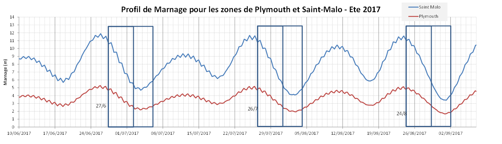

# Projet

Rassemble les documents du projet et les tâches à faire.

## Utilisation de Github

Pour utiliser Github, il faut se créer un compte ici: https://github.com/join

Une fois le compte créé, il est possible de créer des issues: https://github.com/PoissonPilote/Projet/issues

Une issue peut être un tâche, une idée ou un problème à régler. On peut en créer autant qu'on veut car elles seront ensuite analysé et trié en conséquence.

On peut aussi créer et éditer des fichiers au format [markdown](https://fr.wikipedia.org/wiki/Markdown) qui permet de mettre en format facilement le texte.

## Fenêtre de marée

Voici les marnages à Plymouth et Saint-Malo pour l'été 2017:

